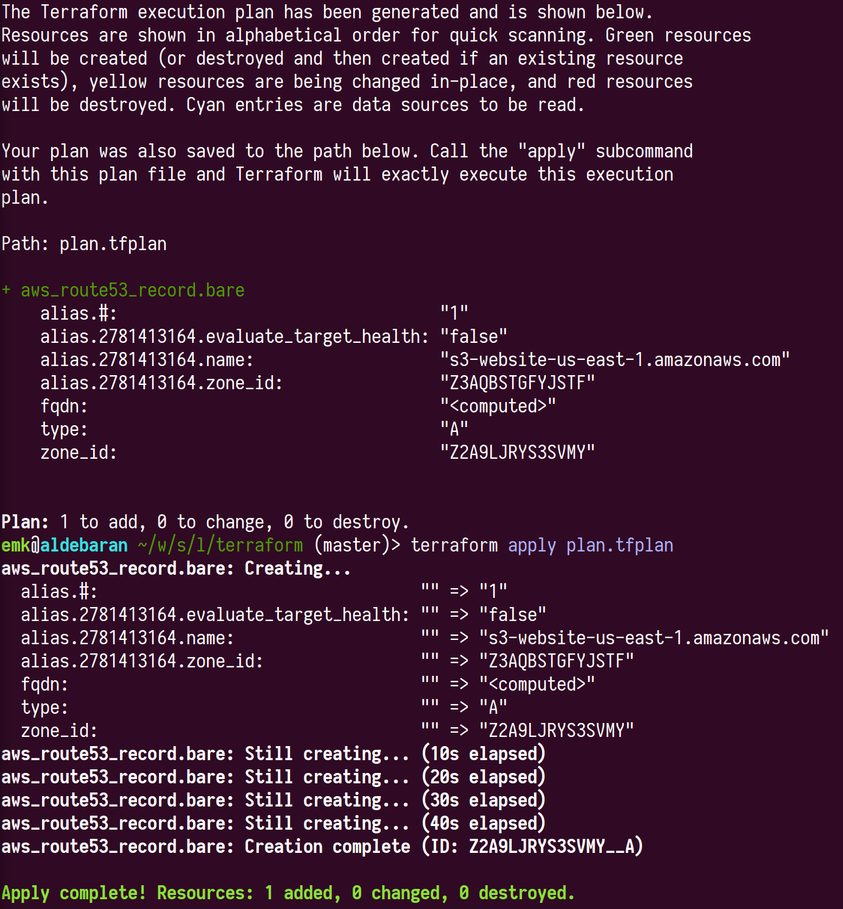
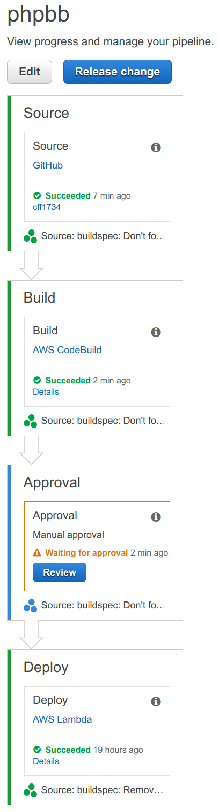

# Server and deployment configuration using Terraform

Instead of creating dozens of AWS resources by hand, we use [Terraform][]
to create everything for us.  This adds another layer of tools, but it
allows us to document everything we do, to reconfigure many things at once,
and to add actual comments explaining what's going on.

## Unlocking files protected with `git crypt` and GPG

First of all, you'll need to install [`git-crypt`][git-crypt] and [GPG][].
And you'll need to be one of the people whose key has been added to this
repo.  Then you can run:

```sh
git crypt unlock
```

This will locally decrypt several files that are encrypted with GPG.

## Setting up AWS access

You'll need to set the following variables in your shell:

```sh
export AWS_ACCESS_KEY_ID="..."
export AWS_SECRET_ACCESS_KEY="..."
export GITHUB_TOKEN="..."
```

## Generating and appling a terraform plan

To initialize Terraform's modules, run:

```sh
terraform get
```

To see what resources Terraform would like to create, update or destroy,
run:

```sh
terraform plan -module-depth=-1 -out=plan.tfplan
```

**Read this output carefully!** You can destroy the site if you're not
paying attention.  If the output looks good, you can run:

```sh
terraform apply plan.tfplan
```

...which will update all our AWS resources as described in the plan.

This process will typically look something like:



## Terraform modules

Many of the subdirectories of this project contain "modules", which
describe a group of related AWS resources.  A module can be instantiated by
calling `module` and passing it a series of parameters.

By convention, the parameters of a module are described in a file named
`$MODULE_NAME/variables.tf`, and all parameters should be documented.

## Testing this on your own account.

To test this on your own account, delete `terraform.tfstate` and
`secrets.tf`, and edit `variables.tf` to use your own domain names, etc.
You'll need to set up the security credential environment variables as
described above.

Then, create the following resources manually in your account:

- An RDS server running MySQL, with the databases required by your containers.
- An EBS volume with the name "language-learners:/data", with the files
  required by your containers.

These aren't managed by Terraform because they contain persistent data that
we don't want to be accidentally destroyed by sloppy refactorings or user
error.

## Pipelines

These Terraform definitions are based around the idea of [CodePipeline][]
build and deployment pipelines. For example:



[CodePipeline]: https://aws.amazon.com/codepipeline/
[git-crypt]: https://github.com/AGWA/git-crypt
[GPG]: https://www.gnupg.org/
[Terraform]: https://www.terraform.io/
